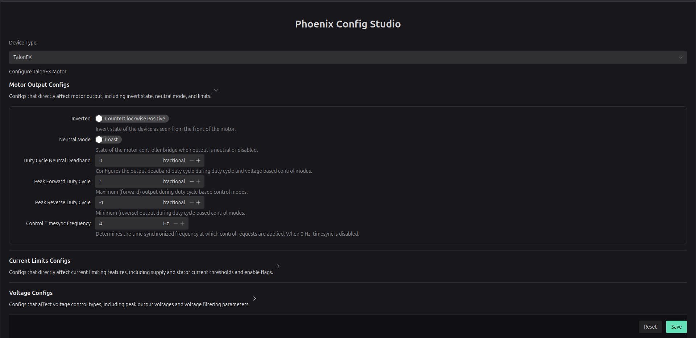
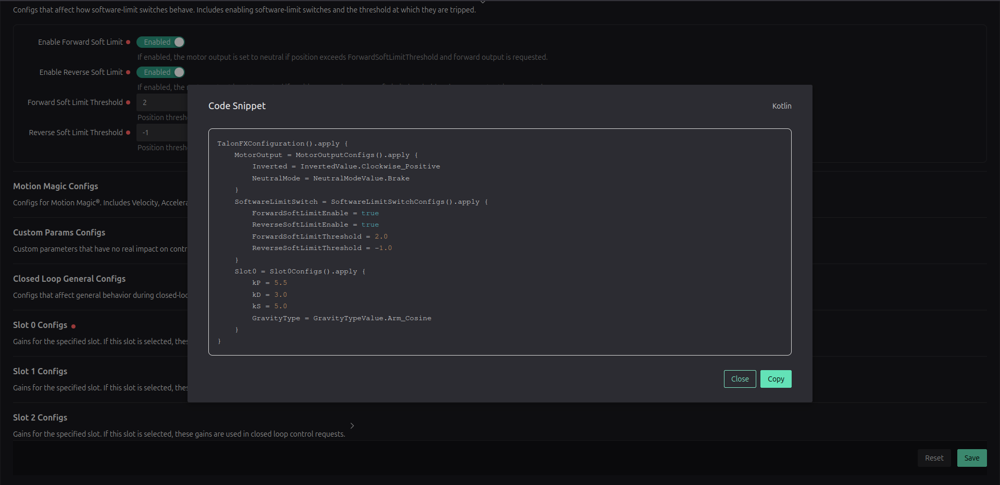

# Phoenix Config Studio

Single-page Vue 3 app for assembling Phoenix device configuration snippets and exporting them as Kotlin code.




## Features

- Section-by-section editors with Naive UI form controls, validation defaults.
- Save action trims untouched defaults, and shows a modal preview of the Kotlin snippet.

## Quick start

Use the Github Pages app already deployed:
[Phoenix Config Studio](https://adarwa.github.io/phoenix-config-studio/)

Or deploy your own instance:

```sh
npm install          # install deps
npm run dev          # start Vite dev server
npm run lint         # run eslint + oxlint
npm run build        # production bundle
npm run preview      # serve the built bundle
```

## Tech stack

- [Vue 3](https://vuejs.org/)
- [Vite](https://vitejs.dev/) for dev server + build.
- [Naive UI](https://www.naiveui.com/) for the component library.
- ESLint + Oxlint + Prettier for linting and formatting.
